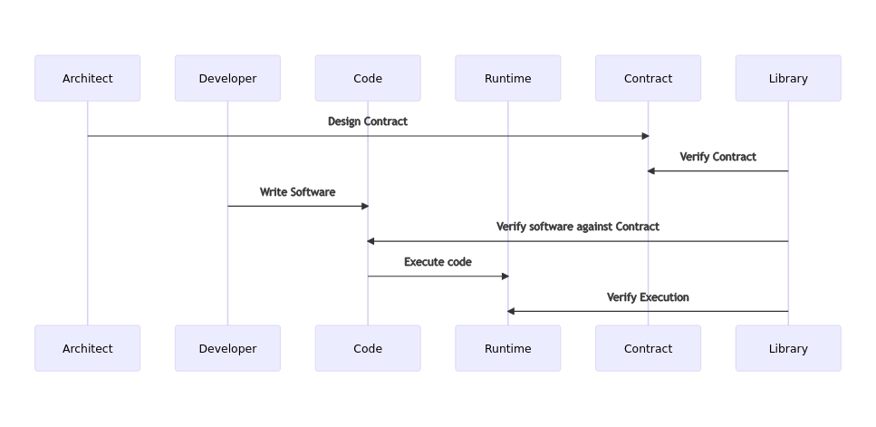
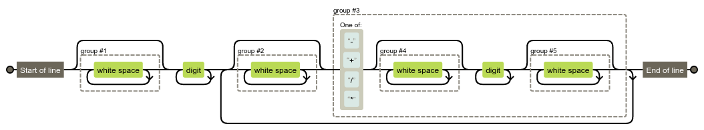
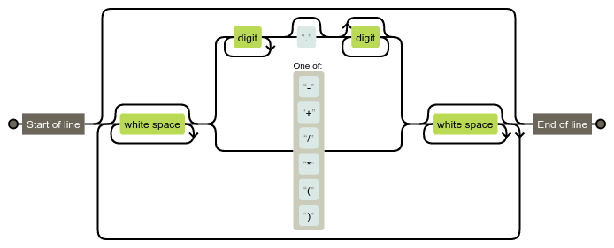

# Predictable Python

This PoC library is intended as a reference for the "Using Contracts for Secure and Verifiable Software Development" paper. The paper contains full details of the project but the summary is as follows:

Programming projects can be split in such a way that security professionals and project architects establish a contract. This contract (and this reference enforcement library) is responsible for ensuring certain properties about a program's execution such as:

1. How long a function is allowed to run
2. Which functions may be called from another function
3. Which imports may be allowed
4. What are the allowed properties of a parameter  
    a. it's type (e.g., int, float, str)
    b. it's range (e.g., `0 < x < 100`)
5. What are the allowable return values

This can be visualized in the diagram below.



To use the contract simple decorators may be employed for enforcement. There are more sophisticated means to inject the contract without the need for decorators but that is beyond the scope of this documentation.

### Walkthrough of the Diagram Above
contrived scenario: A developer wishes to create a four-function calculator for an API. This API should take arbitrarily lengthed strings of numbers and operations and return a result.

#### Architect's Work
First, the Security Architect writes a contract (image below) to ensure the execution of the program is predictable.

```python
from numbers import Number
import re

c = {
    "raise_on_contract_exception": False,
    "functions": ["calculate"],
    "calculate": {
        "params": {
            "calculation": lambda x: isinstance(x, str)
            and re.match(r"^(\s+)?\d+(?:(\s+)?([\-\+\/\*]{1}(\s+)?\d+(\s+)?))+$", x)
        },
        "returns": lambda x: isinstance(x, Number),
        "allowable_calls": ["eval"],
        "max_runtime_seconds": 2.0,
        "allowed_callers": ["<module>"],
    },
    "allowable_imports": ["sys"],
    "global_allowed_calls": ["enforce_contract"],
}
```

We see the following settings described:
- `raise_on_contract_exception = False` // this means that an object will be returned for introspection to not disrupt the flow of execution
- `functions` // a list of allowable function definitions for the program. We only allow a function called `calculate` to be defined.
- `calculate` // the function object defines various properties of the `calculate` function
    - `params` // a dictionary of allowed parameters and a lambda that is used to verify it meets some specified criteria
    - `returns` // a lambda the takes in the return value and compares it to some criteria to ensure it meets the specification
    - `allowable_calls` // a list of calls that can be made from within this function
    - `max_runtime_seconds` // ensures the function does not run forever (or more than the allotted amount of time)
    - `allowed_callers` // the functions that can call this one
- `allowable_imports` // a list of which libraries may be imported by this program
- `global_allowed_calls` // a list of calls which can be made from any function within the program

The architect has ensured that only the `calculate` function is allowed and it can only take in a single parameter of type `str` and that it must meet a specific regex 

```regex
^(\s+)?\d+(?:(\s+)?([\-\+\/\*]{1}(\s+)?\d+(\s+)?))+$
```

This regex can be visualized (using a PNG produced at the wonderful www.regexper.com) as follows:




What we see in the above is that the input must only be whitespace, digits, or basic mathematical operations. This should reduce the risk of using `eval` to almost zero (although valid exception, such as divide-by-zero, are not caught by this regex for demonstration purposes later).

The return value of the function must also be of type `Number` or the call will fail.  Additionally, we only allow a maximimum runtime of 2 seconds or the library will terminate the function.

The Architect may now choose to validate the contract against the Schema in the following way:

```bash
$ python contract_validator.py  -c calc_contract
INFO:root:Contract passes schema validation.
```

In the above we see there are now errors with the validation. If, however, there was a missing value or a wrong type an error would be displayed. For example if the contract read:
```python
c = {
    "raise_on_contract_exception": "no",    # this is wrong!
    "functions": ["calculate"],
    # ...
```

Then the validation would fail like so:
```text
$ python contract_validator.py  -c calc_contract
ERROR:root:Unable to validate contract. Error: Either `raise_on_contract_exception` not in contract or not instance of `<class 'bool'>`.
```
With the contract finished, the Architect can turn it over to the developers to write their program.

### Developer's Work
The developer now writes a short program (seen below).

```python
from contract_util import *
from calc_contract import c as contract
from sys import argv


@enforce_contract(contract)
def calculate(calculation):
    return eval(calculation)


if __name__ == '__main__':
    if len(argv) > 1:
        val = calculate(''.join(argv[1:]))
        if val.ok:
            print(val.returns)
            exit(0)
        print("Invalid Input")
```

We see the developer is utilizing the `enforce_contract` decorator provided by the library after having imported the `contract_utils` and contract itself. We also see the developer is importing `argv` which as we saw above, is allowed by the contract.

The program takes in command line arguments and passes them to the `calculate()` function. This function will verify the parameters against the `params` of the contract _prior to any execution_. If it matches, the function will run. After it is done and a return value is generated, the output will be compared to the `returns` lambda from the contract and only returned if the result is `True`. The return value is produced prior to validation so, in effect, the function will have completed before the enforcement can validate the the return value meets the specification. 

For example:
```text
$ python calculator.py 1 + 2 + 3
6
```

However, we see that a violation of the parameter causes a failure:
```bash
$ python calculator.py 1 + 2 + three
Invalid Input
```

The library is now taking care of the remaining steps of enforcing the contract at runtime.

Let us imagine now that users of the system have requested the ability to use parenthesis to nest operations (e.g., `2 * 2 / (3 * 3 / (4 * 5))`). We see our contract does not allow for this. So the developers kick back the request to the architect with these new requirements.

### Architect's work, Part 2

The architect realizes that they may simplify the regex to `^(?:\s*(?:\d+\.?\d*?|[\-\+\/\*{1,2}\(\)]{1})\s*)*$`, which is visualized below. 



This allows for floating point numbers, which as yet had gone unnoticed since the user population works entirely with integers. It does introduce the problem of allowing somewhat nonsensical operations to be passed (e.g., `*2`). The architect also notices the introduction of parenthesis makes operations with tuples possible. They decide this is acceptable (rightly or wrongly, we are not here to judge) and signs off on this new regular expression for the parameter validation and updates the contract.

The architect alerts the development team that the contract has been updated and the new inputs will be allowed.

### A few more notes:
With the `raise_on_contract_exception` set to False, we may still see the specific exception in the following way:
```python
if __name__ == '__main__':
    if len(argv) > 1:
        val = calculate(''.join(argv[1:]))
        if val.ok:
            print(val.returns)
            exit(0)
        print(val.exception)    # we look at the exception property if not val.ok
```
Result:
```bash
$ python calculator.py 1 + 2 + three
Parameter `calculation` out of contract specification.
```

If we set the `raise_on_contract_exception` to `True` the exception will be raised and we'll need to catch as per usual.

```python
# I am not doing error handling to keep the code short
if __name__ == '__main__':
    if len(argv) > 1:
        val = calculate(''.join(argv[1:]))
        print(val)
```

Result:

```bash
$ python calculator.py 1 + 2 + three
Traceback (most recent call last):
  File "/home/gsh/code/predictable-python/calculator.py", line 13, in <module>
    val = calculate(''.join(argv[1:]))
  File "/home/gsh/code/predictable-python/contract_util.py", line 123, in wrapped
    raise ContractException(
contract_util.ContractException: Parameter `calculation` out of contract specification.
```


## Limitations
### Timing
When we set the max_runtime_seconds, the function is forked to a new process and executed there. This allows us to forcibly terminate the process if it exceeds the specified limit. Consequently, any functions with side-effects should be carefully scrutinized to ensure that system state changes (e.g., temp file generation, partial network calls, etc.) are well considered. Ideally pure functions or ones with atomic operations should be employed. 